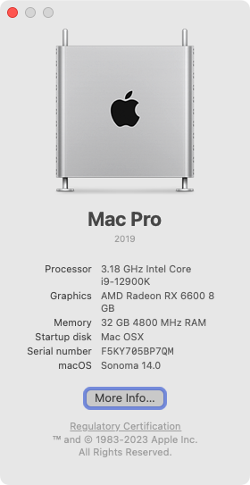

## Hackintosh Opencore 0.9.5 for Asus ROG STRIX Z690-I GAMING WiFi - mac◊OS

> [!WARNING]  
> This guide is not intended for beginner, you have been warned.
> Please read everything before starting!

### Hardware

| Component            | Item                                                                                                                                                                                 |
| -------------------- | ------------------------------------------------------------------------------------------------------------------------------------------------------------------------------------ |
| Processor            | [Intel Core i9-12900K 3.2 GHz](https://pcpartpicker.com/product/gGH7YJ/intel-core-i9-12900k-32-ghz-8-core-processor-bx8071512900k)                                                   |
| **Motherboard**      | [Asus ROG STRIX Z690-I GAMING WIFI](https://pcpartpicker.com/product/yzWzK8/asus-rog-strix-z690-i-gaming-wifi-mini-itx-lga1700-motherboard-rog-strix-z690-i-gaming-wifi)             |
| **Memory**           | [TEAMGROUP T-Force Vulcan 64 GB (2 x 32 GB) DDR5-6000](https://pcpartpicker.com/product/kvfxFT/teamgroup-t-force-vulcan-64-gb-2-x-32-gb-ddr5-6000-cl38-memory-flbd564g6000hc38adc01) |
| **Storage (NVME)**   | [Samsung 990 Pro 1 TB M.2-2280](https://pcpartpicker.com/product/FsqPxr/samsung-990-pro-1-tb-m2-2280-pcie-40-x4-nvme-solid-state-drive-mz-v9p1t0bw)                                  |
| **Storage (SSD)**    | [Samsung 870 Evo 1 TB](https://pcpartpicker.com/product/7nsnTW/samsung-870-evo-1-tb-25-solid-state-drive-mz-77e1t0bam)                                                               |
| **GPU**              | [PowerColor Fighter Radeon RX 6600 XT](https://pcpartpicker.com/product/nyH7YJ/powercolor-radeon-rx-6600-xt-8-gb-fighter-video-card-6600xt-8gbd6-3dh)                                |
| **WiFi + Bluetooth** | [BCM943602CS](https://www.aliexpress.com/item/32847834498.html) + [PCI-E Adaptor](https://shopee.com.my/product/162227071/3405707076)                                                |
| **Case**             | [DAN Cases A4-SFXv4.1](https://pcpartpicker.com/product/BDkgXL/dan-cases-a4-sfxv41-mini-itx-desktop-case-a4sfxv41-s)                                                                 |
| **Power Supply**     | [Lian Li SP850 850 W 80+](https://pcpartpicker.com/product/t9bTwP/lian-li-sp850-850-w-80-gold-certified-fully-modular-sfx-power-supply-sp850-black)                                  |

### Prerequisite

Please understand all OpenCore configuration by reading [Configuration.pdf](https://github.com/acidanthera/OpenCorePkg/blob/master/Docs/Configuration.pdf)

### Required Tools

- [GenSMBIOS](https://github.com/corpnewt/GenSMBIOS)
- [EFI-Agent](https://github.com/headkaze/EFI-Agent)
- [Hackintool](https://github.com/headkaze/Hackintool)

### Step By Step Installation Guide

1.  [BIOS configuration](docs/BIOS.md)
2.  [macOS installation media](docs/INSTALLER.md)
3.  [OpenCore EFI](docs/OC.md)

### What's Working/What's Not

Working

- Ethernet
- Onboard Audio
- HDMI Audio
- DP Audio
- IGPU in headless mode
- IGPU as main display output
- App Store
- Wake/Sleep
- Restart
- Shutdown
- USB (Correct SS/HS speed)
- All DP and HDMI port
- Dual monitor from boot
- Apple Music (iTunes)
- iMessage
- Facetime
- Handoff
- Airdrop
- Continuity
- AirPlay
- Apple TV+ (Only on Catalina, Safari 13)
- Netflix/Prime in Safari - (Only on Catalina, , Safari 13)

Not Tested

- FileVault
- Power Nap
- Built-in WiFi and Bluetooth. May work with [itlwm](https://openintelwireless.github.io/). If you need stable WiFi+BT, use native apple card
