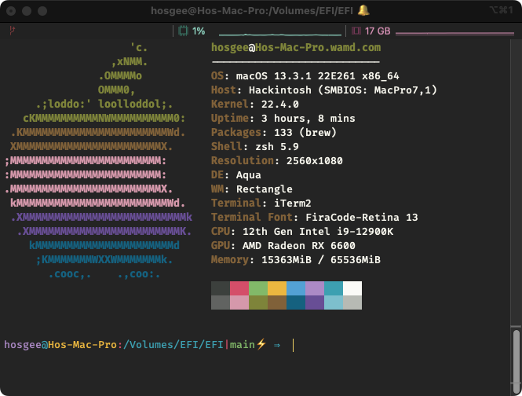

# OpenCore EFI for AMD Ryzen Hackintosh 

## Verified Specification

| **Component**    | **Model**                                  |
| ---------------- | ------------------------------------------ |
| CPU              | Intel Core i9-12900K Alder Lake @ 3.2GHz   |
| Motherboard      | ASUS ROG STRIX Z690-I GAMING WIFI          |
| RAM              | 64GB (2 x 32GB) TeamGroup Vulcan @ 4800MHz |
| GPU              | PowerColor AMD Radeon RX 6600              |
| Audio Chipset    | ALC-4080                                   |
| Ethernet         | Intel I225                                 |
| WiFi & Bluetooth | Custom Wifi Card (BCM94360NG)              |
| OS Disk (SSD)    | Samsung 870 EVO 1TB                        |

**macOS version**: 13.3.1 (a) (22E261) \
**OpenCore version**: REL-092-2023-05-08

## Installation

### Bootable USB

1. Follow [this guide](https://dortania.github.io/OpenCore-Install-Guide/installer-guide/) to create your bootable USB.

2. Clone this repository and copy "BOOT" & "OC" directories to your "EFI" directory on your bootable USB. The structure should look somewhat like this: `EFI -> BOOT, OC`.

## BIOS Settings

| **Option**            | **Status**           |
| --------------------- | -------------------- |
| SATA Mode             | AHCI                 |
| Above 4G Decoding     | Enabled 1 |
| EHCI/XHCI Hand-off    | Enabled              |
| SVM                   | Enabled              |
| CSM                   | Disabled             |
| Resizable BAR Support | Disabled             |
| Secure Boot           | Disabled             |

1 If you have this option in BIOS you must also remove `npci=0x2000` from `boot-args` in your configuration file.

**Some of these options may not exist in your firmware, just try to match it as closely as possible.**

**Before booting macOS remember to update BIOS to the latest version.**

